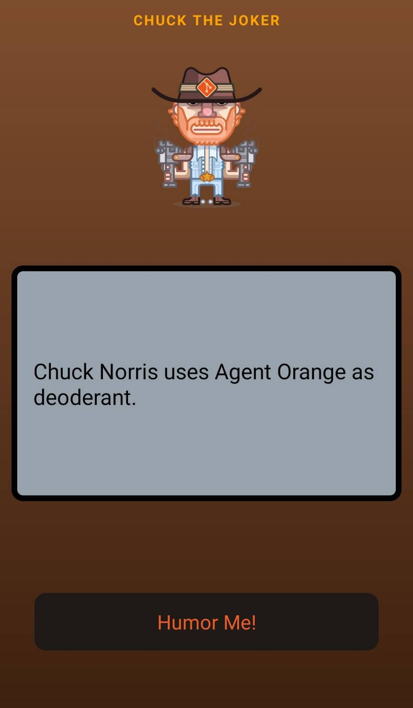

# Chuck The Joker

This is the mobile app for fun. App uses [joke API](https://api.chucknorris.io/) and generate you some Chuck Norris jokes.

## Screenshot:

Currently includes:

- React Native
- React Navigation
- MobX State Tree
- TypeScript
- And more!

## Game logic:
Click the "Humor Me!" button and get some jokes.

## Contribution:
Feel free to `fork` this project and add whatever you like. If you have any suggestions or any comments please feel free to contact me or to open an issue, use free license art assets please.
